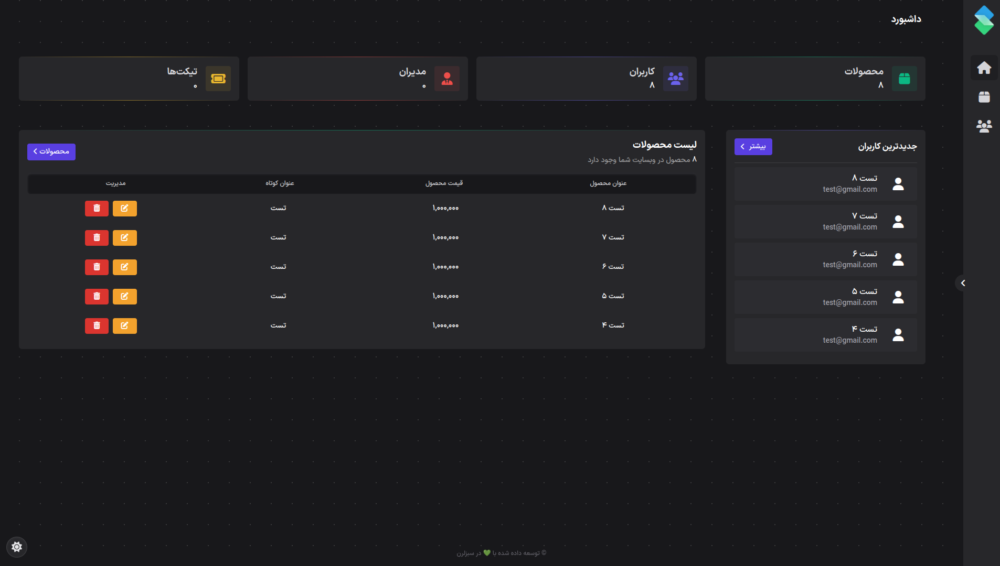
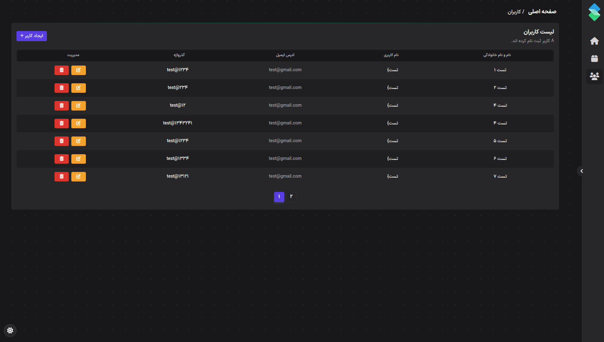
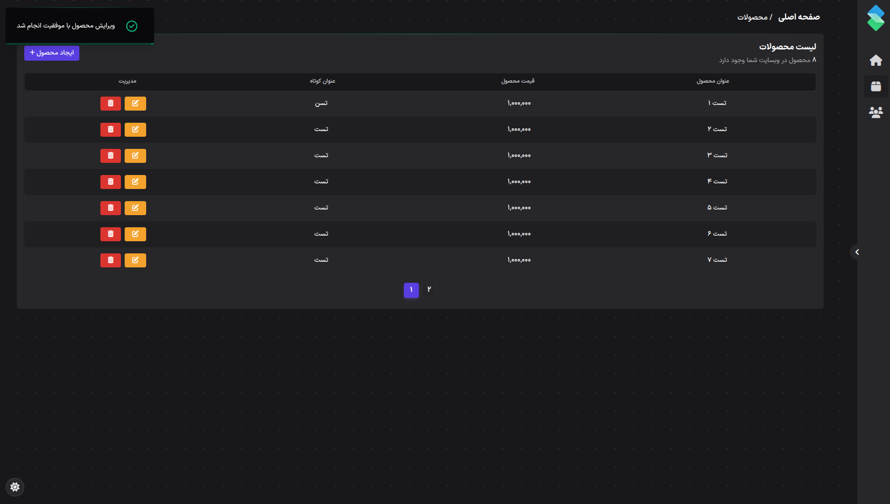
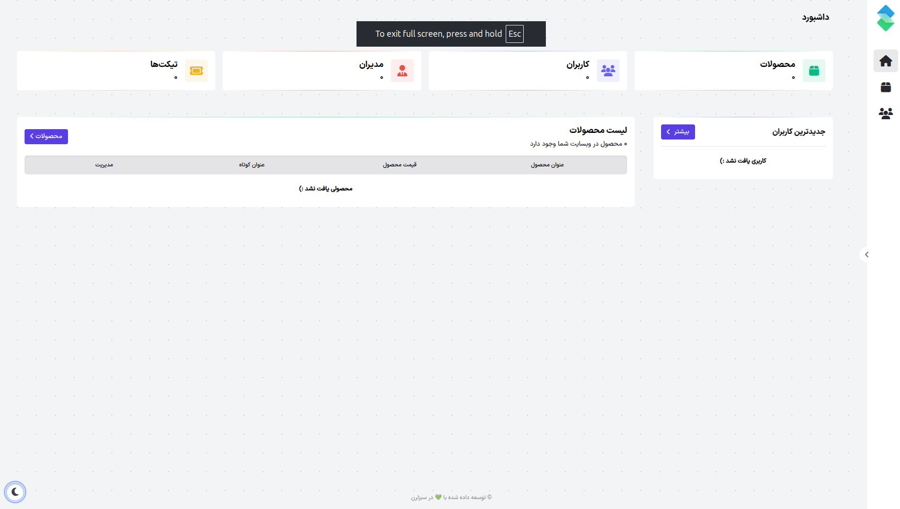
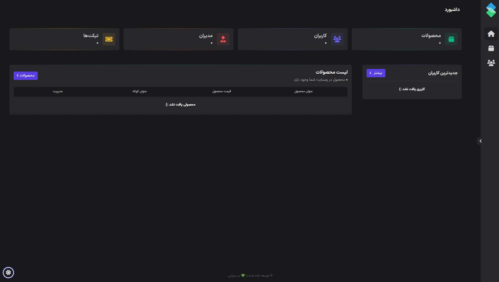

# CMS Dashboard

A lightweight and responsive CMS dashboard built with vanilla JavaScript for managing users and products.  
The project includes full CRUD functionality, toast notifications, localStorage persistence, dark/light theme switching, dynamic pagination, and Persian language support.

---

## 🛠 Tech Stack

<p align="left">
    <a href="https://developer.mozilla.org/en-US/docs/Web/JavaScript" target="_blank" rel="noreferrer"></a>
    <a href="https://developer.mozilla.org/en-US/docs/Glossary/HTML5" target="_blank" rel="noreferrer"></a>
    <a href="https://www.w3.org/TR/CSS/#css" target="_blank" rel="noreferrer"></a>
       <a href="https://tailwindcss.com/docs" target="_blank" rel="noreferrer"></a>
</p>

---

## Overview

This project is a front-end CMS dashboard developed as a portfolio project to demonstrate practical JavaScript skills, state management, and interactive UI behavior.  
It is designed with a Persian interface and supports RTL-friendly layouts for a better localized user experience.



---

## Features

- **User Management**  
  Add, edit, and delete users with an intuitive and responsive interface.
  
  

- **Product Management**  
  Add, edit, and delete products with persistent storage using `localStorage`.
  
  

- **Toast Notifications**  
  Visual feedback is provided for all actions, including success messages, validation errors, and delete confirmations.

- **Dark / Light Theme**  
  Users can switch between dark and light modes, with the selected theme saved in `localStorage`.
  




- **Dynamic Pagination**  
  Content is displayed through live pagination for better usability and cleaner navigation.
  
- **Persian Language Support**  
  The interface is fully available in Persian and optimized for RTL layouts.

---

## How It Works

- Users and products can be created, updated, and removed directly from the dashboard.
- All data is stored locally in the browser using `localStorage`.
- Theme preferences are preserved across sessions.
- Pagination is updated dynamically based on the available data.
- Toast notifications provide immediate feedback for user actions.

---

## Project Structure
```bash
project-root/
├── index.html
├── style.css
├── script.js
└── assets/
