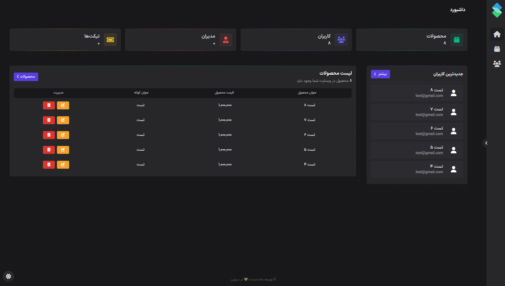
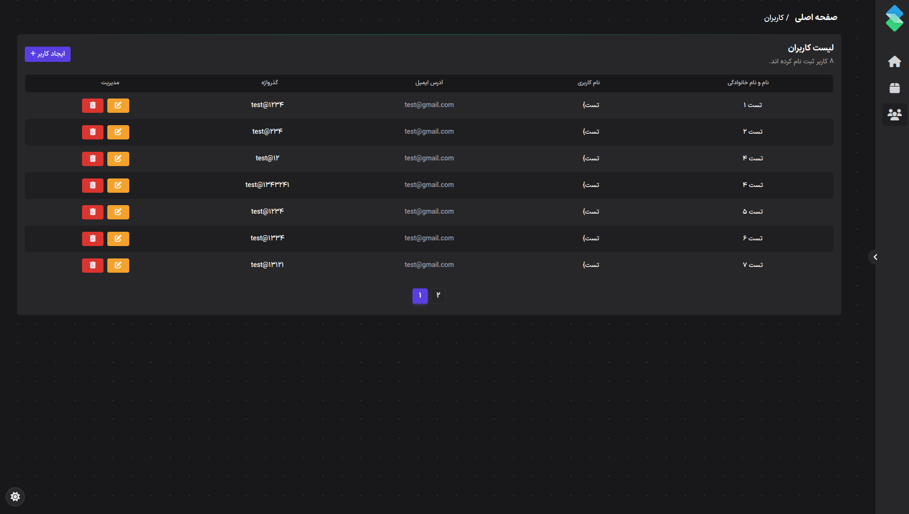
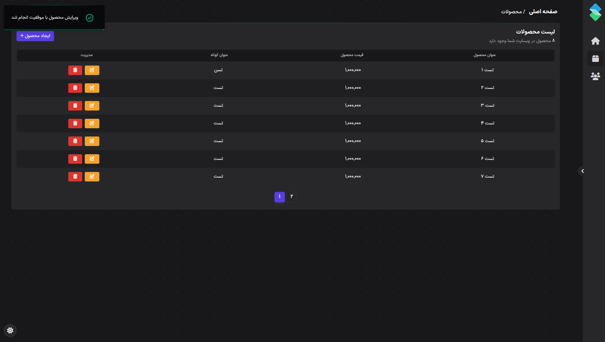
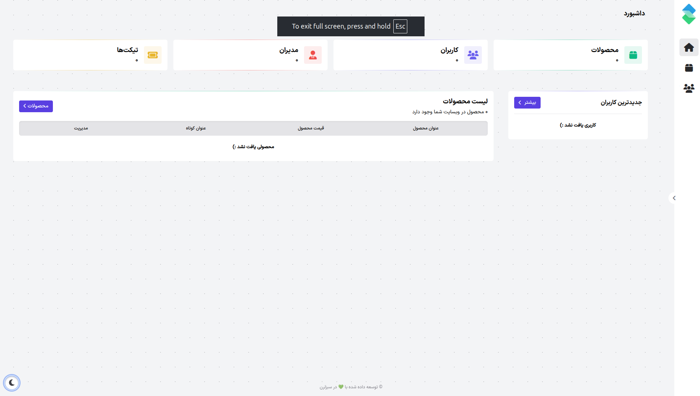
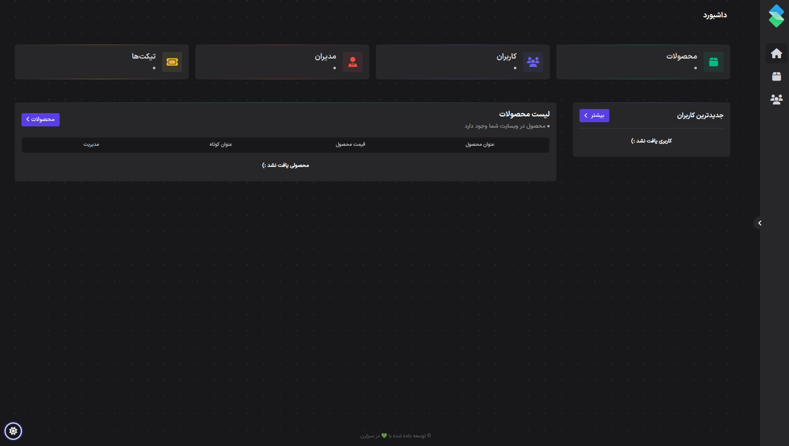

# CMS Dashboard

A lightweight and responsive CMS dashboard built with Vanilla JavaScript for managing users and products.

The project demonstrates practical front-end development concepts such as DOM manipulation, state management, local data persistence, theme switching, pagination, and user interaction handling.

---

## 🛠 Tech Stack

    
    
    
    

---

## 📖 Overview

This project was developed as a portfolio application to practice and demonstrate JavaScript fundamentals through a real-world dashboard interface.

The dashboard allows users to manage products and users through a client-side CRUD workflow while providing a smooth user experience with theme switching, toast notifications, pagination, and persistent browser storage.

The interface is fully localized in Persian and optimized for RTL layouts.

---

## ✨ Features

### 👥 User Management

* Create new users
* Edit user information
* Delete users
* Responsive and user-friendly interface

### 📦 Product Management

* Add new products
* Update existing products
* Remove products
* Persistent storage using localStorage

### 🔔 Toast Notifications

Visual feedback for:

* Successful actions
* Validation errors
* Delete confirmations

### 🎨 Dark / Light Theme

* Dark mode support
* Light mode support
* Theme persistence using localStorage

| Light Theme                | Dark Theme                |
| -------------------------- | ------------------------- |
|  |  |

### 📄 Dynamic Pagination

* Dynamic page generation
* Better navigation for large datasets
* Automatically updates when data changes

---

## ⚙️ How It Works

* Users and products can be created, viewed, updated, and deleted directly from the dashboard.
* All data is stored locally in the browser using localStorage.
* Theme preferences are saved and restored automatically.
* Pagination updates dynamically based on available data.
* Toast notifications provide immediate feedback for user actions.

---

## 📌 Note

The UI template and design were provided as part of the course material.

My contribution focused on implementing the application logic and functionality, including:

* User management
* Product management
* Client-side CRUD operations
* localStorage integration
* Theme switching
* Dynamic pagination
* Toast notifications
* DOM manipulation and event handling
